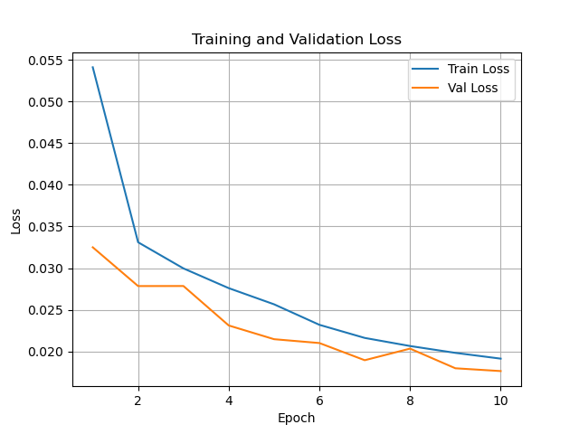
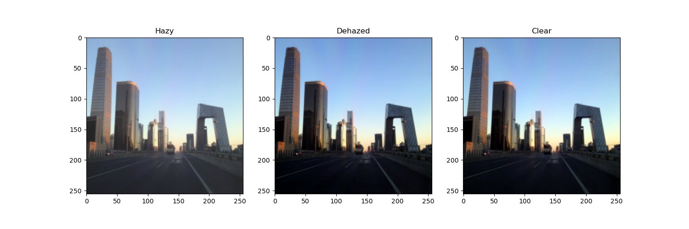

# MAPD-Net V4.0模型

## 项目简介

本项目提出了一种**Multi-Scale Attention and Physics-Based Dehazing Network (MAPD-Net)**去雾模型，结合了物理约束与深度学习的优势。在网络设计上，我们基于大气散射模型引入了**物理约束项**，确保去雾结果的物理合理性，同时采用**SE通道注意力机制和残差结构**，增强了模型的特征表达能力。通过扩展训练数据规模并引入**验证机制**，显著提升了模型的泛化能力。此外，我们将**预训练的VGG16感知损失**引入训练过程，改善了图像的纹理细节恢复与主观视觉质量。最后，我们设计了**多尺度特征提取模块和非局部注意力机制，结合数据增强和随机Dropout技术**，进一步优化了模型在复杂场景下的表现。

---

## 文件结构

```plaintext
Final_Project/
├── data/
│   └── RESIDE/
│       ├── train/
│       │   ├── hazy/        # 有雾图像（训练集）
│       │   └── clear/       # 清晰图像（训练集）
│       ├── test/
│       │   ├── hazy/        # 有雾图像（测试集）
│       │   └── clear/       # 清晰图像（测试集）
├── result/
│   ├── logs/
│   │   ├── loss_curve.png   # 训练和验证损失曲线
│   │   └── training_log.txt # 训练日志
│   ├── models/
│   │   └── best_model.pth   # 保存的最佳模型权重
│   ├── visualization_100/   # O-HAZY 和 NH-HAZY测试结果可视化输出
│   └── visualization_500/   # RESIDE测试集测试结果的可视化输出
├── src/
│   ├── data/
│   │   └── dataset.py       # 数据加载模块
│   ├── models/
│   │   └── improved_model.py # 改进的去雾模型
├── main.py                  # 主函数，用于检查数据集和测试模型
├── train.py                 # 模型训练脚本
├── test.py                  # 模型测试脚本
└── requirements.txt         # 环境依赖
```

---
## 数据集
由于文件大小限制，数据集未直接上传到仓库。请点击以下链接下载数据集：

- [RESIDE 数据集](https://sites.google.com/view/reside-dehaze-datasets)
- [O-Hazy 数据集](https://data.vision.ee.ethz.ch/cvl/ntire18//o-haze/)
- [NH-Haze 数据集](https://data.vision.ee.ethz.ch/cvl/ntire20/nh-haze/)

## 功能模块说明

### 1. 数据加载与预处理

文件路径：`src/data/dataset.py`

- 数据按字母排序加载，支持动态的训练和测试数据预处理。
- 训练集数据增强：调整亮度、对比度、饱和度以及高斯模糊以模拟光照和雾霾变化。
- 验证和测试集保持标准化处理，确保评估的公平性。

### 2. 改进的去雾模型

文件路径：`src/models/improved_model.py`

改进后的网络**PhysicalDehazeNet**包含以下主要组件：
- **传输率预测模块**：采用多尺度卷积提取局部和全局特征。
- **大气光预测模块**：使用全局平均池化预测全局光照。
- **残差模块**：捕获细节和高频信息。
- **通道注意力模块**：动态调整通道权重，突出关键特征。
- **物理约束优化**：结合大气散射模型计算初步去雾结果，并通过主网络优化图像质量。

### 3. 训练与验证

文件路径：`train.py`

- 使用 **CombinedLoss**，结合了重建损失、感知损失、传输率约束损失和大气光约束损失。
- 采用 **Adam** 优化器，结合余弦退火调度动态调整学习率。
- 支持实时验证并保存最佳模型权重。

### 4. 模型测试与可视化

文件路径：`test.py`

- 测试结果包括：
  - **PSNR**（峰值信噪比）
  - **SSIM**（结构相似性指数）
- 自动生成性能指标趋势图、分布直方图以及前 5 / 后 5 图像的对比可视化。

---

## 快速开始

### 环境依赖

请确保安装以下依赖，推荐使用 Python 3.8 或以上版本。

```plaintext
torch>=1.9.0
torchvision>=0.10.0
numpy
matplotlib
scikit-image
tqdm
Pillow
```

使用以下命令安装依赖：

```bash
pip install -r requirements.txt
```

### 数据准备

将 **RESIDE** 数据集解压至 `data/RESIDE` 文件夹下。结构如下：

```plaintext
data/RESIDE/
├── train/
│   ├── hazy/        # 有雾图像（训练集）
│   └── clear/       # 清晰图像（训练集）
└── test/
    ├── hazy/        # 有雾图像（测试集）
    └── clear/       # 清晰图像（测试集）
```


### 模型训练

运行以下命令开始训练：

```bash
python train.py
```

训练过程中，将实时生成损失曲线和日志文件，最佳模型保存在 `result/models/best_model.pth`。

### 模型测试

使用以下命令进行模型测试：

```bash
python test.py
```

RESIDE测试集的测试结果包括图像去雾效果、PSNR 和 SSIM 的分布图，存储在 `result/visualization_500/` 目录下。

---

## 结果展示

### 1. 损失曲线

训练和验证损失随 epoch 变化的曲线：



### 2. 去雾效果对比

对去雾结果的前 5 张和后 5 张进行可视化展示（此处以Top5中的一组图为例）：



---

## 项目改进方向

1. **轻量化模型设计**：未来将通过**网络剪枝**和**知识蒸馏**优化模型结构，降低计算复杂度，使模型更适合资源受限的场景部署。
2. **泛化能力提升**：通过扩展训练数据集和引入**生成对抗网络（GAN）**，增强模型在复杂场景和室内外环境中的鲁棒性和适应性。
3. **损失函数的进一步优化**：引入**对抗损失**和**自适应损失函数**，在提升视觉真实感的同时，更好地适应多样化应用场景的需求。


---

## 作者信息

- **姓名**: [罗晓彤]
- **联系方式**: [luoxiaotong2022@email.szu.edu.cn]
- **职务-模型搭建与算法工程**：负责模型的整体设计与实现，具体包括设计和实现多尺度特征提取模块、注意力机制等关键组件，优化训练策略和损失函数以提升模型性能。撰写文档中主导技术模块（如模型设计、算法优化）的内容。

<br>

- **姓名**: [陈鑫尧]
- **联系方式**: [2022361085@email.szu.edu.cn]
- **职务-数据收集与实验分析**：负责收集、预处理RESIDE、O-Hazy和NH-Hazy等数据集，设计数据增强策略，记录PSNR和SSIM等关键性能指标。通过实验结果的可视化，为模型的性能分析提供直观支持。同时阅读相关研究论文，寻找并整理参考文献。在文档撰写过程中，负责撰写相关工作、实验论证部分。

<br>

- **姓名**: [庄嘉怡]
- **联系方式**: [2022361065@email.szu.edu.cn]
- **职务-实验记录与文档撰写**：负责记录实验的全流程信息，例如数据集选择、训练过程中的问题以及对应的解决方案等。负责撰写报告简介、理论基础部分，整合实验图表并添加清晰的说明。最终完成报告初稿的排版，协助润色。

<br>
在本项目中，我们团队通过明确分工与高效协作，充分发挥了每位成员的特长与优势，同时确保研究任务的连贯性与一致性。通过定期团队会议，我们保持了清晰的目标导向和流畅的沟通机制，各成员在独立完成任务的同时也能交叉支持，如模型设计与数据处理的协同优化、实验分析与记录的紧密结合等。我们依托项目管理工具如语雀和Github，实现了实验记录、结果分析和文档撰写的高效整合。此外，在关键任务和紧急问题上，团队展现了极高的灵活性与协同性，确保了研究进度和质量的同步推进。

